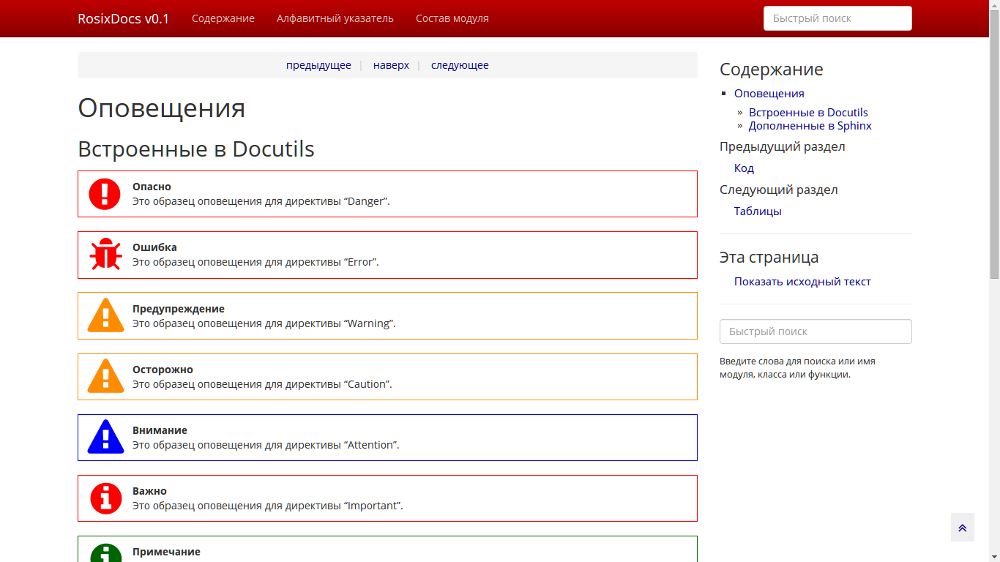

=====
About
=====

RosixDocs - it's theme for Sphinx from Rosix projects.

=====
Usage
=====

.. code-block:: python

    # in your conf.py

    ...

    html_theme = 'default'

    #html_theme_path = []

    try:
        from rosixdocs import get_themes_path

        html_theme_path = [ get_themes_path() ]

        html_theme = 'html'

    except:
        pass

    ...
